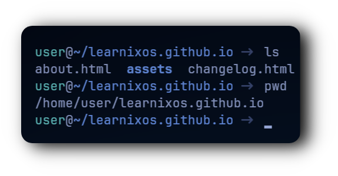

  

  
  <h1 style="font-size: 48px; margin-top: 20px;">
    <a href="https://learnixos.github.io/" style="text-decoration: none; color: inherit;">
      𝗟𝗫𝗦𝗛
    </a>
  </h1>
  

    𝗔 𝗺𝗶𝗻𝗶𝗺𝗮𝗹 𝘀𝗵𝗲𝗹𝗹 𝗳𝗼𝗿 𝘁𝗵𝗲 𝗟𝗫𝗢𝗦 𝗗𝗶𝘀𝘁𝗿𝗶𝗯𝘂𝘁𝗶𝗼𝗻
  

---

<h1>
  
</h1>
